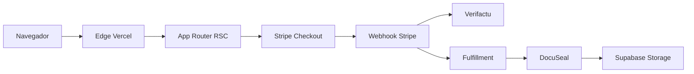

# Arquitectura de Afiladocs

### Propósito de este documento

- **Objetivos:** Describir capas, fronteras de módulos y no-objetivos del
  SaaS para que un cambio no rompa checkout, firma, RLS ni el contrato de
  env vars.
- **Estructura:** Propósito del producto → capas → módulos → decisiones
  cardinales → calidad → no-objetivos → stack.
- **Contenido a integrar según contexto:** Adapta módulos y stack de este
  repo. No copies la arquitectura de un export estático ni de una CLI. No
  metas el catálogo en env vars. DocuSeal es el único firmante.

Documento de "cómo y por qué". Describe la forma del sistema, las decisiones
cardinales y los puntos de extensión. Para el "qué", revisa el código y los
ADR. El índice operativo vive en [docs/README.md](docs/README.md).

## 1. Propósito

Tienda B2C de plantillas legales rellenables (Valencia) + revisiones
expertas humanas. Entrada: catálogo Prisma y checkout Stripe. Salida:
documento firmado (DocuSeal) o plantilla descargable, factura Verifactu y
email transaccional.

Sitio: [afiladocs.com](https://afiladocs.com).

## 2. Capas



```
Visitante / cliente autenticado
    │  HTML RSC + Server Actions (Vercel cdg1)
    ▼
src/app/(marketing)   tienda, ficha, landings
src/app/portal        intake, descarga, facturas
src/app/ops           backoffice (admin/ops)
src/app/api           checkout, webhooks, crons, health
src/lib               dominio + adaptadores lazy
prisma/               products, orders, documents, profiles
```

## 3. Módulos

### `src/app/` · App Router

- `(marketing)/` — home, `/tienda`, `/producto/[slug]`, legales.
- `portal/` — cliente autenticado (Supabase Auth).
- `ops/` — roles `admin` / `ops` (`requireRole`).
- `api/checkout` — Stripe Checkout Session (Zod + rate-limit).
- `api/webhooks/stripe` y `api/webhooks/docuseal` — firma verificada,
  idempotencia por `*_event_id` en `audit_log`.
- `api/health` — liveness sin dependencias externas.

### `src/lib/`

- `env.ts` — `serverEnv` / `publicEnv` con lazy getters.
- `catalog/query.ts` — productos activos (React cache).
- `orders/fulfillment.ts` + `dispatch.ts` — auto-entrega por `delivery_mode`.
- `signing/` — DocuSealAdapter (único firmante).
- `stripe/`, `verifactu/`, `email/`, `rate-limit.ts`.

### `prisma/`

- Modelos: `profiles`, `orders`, `documents`, `products`, `product_packs`,
  `subscriptions`, `monitor_alerts`, `audit_log`.
- `DATABASE_URL` (pooler 6543) + `DIRECT_URL` (5432, migraciones).

## 4. Decisiones cardinales

- **Catálogo en Prisma**, no en whitelist de env vars.
- **DocuSeal único firmante** (Documenso descartado).
- **Supabase = Vercel Marketplace Free**; `supabase.afiladocs.com` descatalogado.
- **Secretos solo server-side**; nunca `NEXT_PUBLIC_*` para claves privadas.
- **RGPD**: `rgpd_accepted === true` validado en servidor antes de PII.
- **SDKs lazy** (Stripe, Resend, DocuSeal, Verifactu) dentro de funciones.

Detalles en [`docs/architecture/decisions/`](docs/architecture/decisions/).
El stub [`DECISIONS.md`](DECISIONS.md) apunta aquí.

## 5. Calidad

- Vitest + happy-dom; umbral documentado ≥ 70 % statements en
  `src/lib/stripe/**`, `src/lib/orders/**`, `src/lib/verifactu/**`,
  `src/app/api/**` (flota ≥ 70 %).
- Playwright e2e (Chromium).
- CI: `quality` (env, typecheck, lint, audit informativo) → `test`
  (Vitest + coverage) → `build` (`.next`) → `smoke` (`/api/health`).
  Job de producto `security` (actionlint + zizmor) no se renombra.

## 6. Puntos de extensión

- Nuevo SKU: seed Prisma + ficha + IDs Stripe/DocuSeal vía `/ops/productos`.
- Nueva API route: Zod + rate-limit + test happy/error + `rgpd_accepted` si hay PII.
- Nueva plantilla de email: `src/emails/` + test del handler.

## 7. No-objetivos

- No reescribir la UI/UX comercial en PRs de plataforma
- No reintroducir Documenso ni catálogo por env vars
- No secretos en el repo ni en `NEXT_PUBLIC_*`
- No pisar `SUPPORT.md` ni runbooks vivos

## 8. Trade-offs aceptados

- **Vendor lock-in moderado** con Vercel + Stripe + Supabase Marketplace.
- **Placeholders de CI** en lugar de una BD real en el runner.
- **Audit de dependencias informativo** (no gate) para no forzar bumps de Next.js.

## 9. Telemetría y observabilidad

- Sentry (`@sentry/nextjs`) + Vercel Analytics / Speed Insights.
- Logs estructurados: `console.log(JSON.stringify({ event, ts, ... }))`.
- Crons Vercel autenticados con `CRON_SECRET`.

## 10. Riesgos conocidos

- Frontal 500 si faltan env públicas de Supabase en Vercel (issue #59).
- Webhook Stripe/DocuSeal no procesado → runbooks en `docs/runbooks/`.
- Go-live Stripe LIVE (P0b) bloquea la tienda pública.

## 11. Stack

Next.js App Router · React 19 · TypeScript strict · Tailwind v4 · Node 22 ·
pnpm · Prisma 7 · Supabase · Stripe · DocuSeal · Verifactu · Resend ·
Vitest · Playwright · Vercel (`cdg1`).
